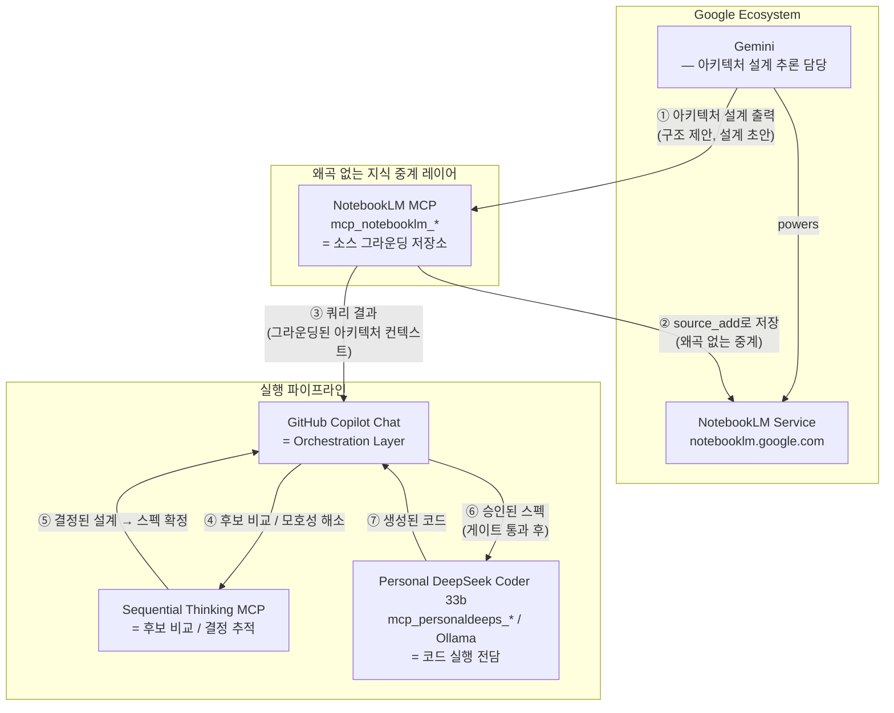

# MCP Routing Decision Tree

## Tool Relationship Map



---

## 아키텍처 설계 전달 흐름 (핵심 패턴)

DeepSeek, Sequential Thinking, Copilot은 **자체적으로 아키텍처 구조를 설계할 수 없**거나 신뢰도가 낮습니다.
따라서 아키텍처 설계는 반드시 아래 3단계 경로를 통해야 합니다:

```
Gemini (설계 추론)
  → NotebookLM에 소스로 저장 (왜곡 방지 중계)
    → Copilot이 NLM MCP로 쿼리 (그라운딩된 컨텍스트 수신)
      → Sequential Thinking으로 검증
        → 승인 후 DeepSeek으로 구현
```

### 각 단계의 역할

| 단계 | 도구 | 이유 |
|---|---|---|
| **① 설계 생성** | Gemini (Copilot Chat) | 아키텍처 추론 능력 보유. 단, 이 결과는 즉시 구현에 쓰면 안 됨 |
| **② 왜곡 없는 저장** | NotebookLM MCP `source_add` | Copilot의 컨텍스트 창에 직접 넣으면 왜곡/축약 발생. NLM에 저장하면 인용 가능한 소스가 됨 |
| **③ 쿼리 수신** | NotebookLM MCP `notebook_query` | Copilot이 설계 내용을 소스 기반으로 정확히 수신 |
| **④ 검증** | Sequential Thinking MCP | 후보 간 비교, 모호성 해소 |
| **⑤ 구현** | DeepSeek Coder 33b | 승인된 스펙만 수신, 아키텍처 재설계 금지 |

### 왜 NotebookLM이 중계 레이어인가

- Copilot Chat 컨텍스트는 대화가 길어지면 **초기 설계 내용이 축약·왜곡**될 수 있음
- NotebookLM에 저장된 소스는 **쿼리 시마다 원본 그대로 인용**되므로 정보 손실 없음
- 즉, Gemini가 설계한 내용을 NLM에 저장 → Copilot이 NLM MCP로 쿼리 = **무손실 설계 전달**

---

### Key Distinctions

| 관계 | 방향 | 흐르는 정보 |
|---|---|---|
| **Gemini → NotebookLM** | Gemini가 설계한 아키텍처를 NLM 소스로 저장 | Gemini 직접 출력은 임시적; NLM 저장 후에야 파이프라인에서 신뢰 가능 |
| **NotebookLM → Copilot** | NLM MCP 쿼리 결과 → Copilot 컨텍스트 | 그라운딩된 아키텍처 컨텍스트, 왜곡 없음 |
| **Copilot → DeepSeek** | 승인된 스펙 전달 → 코드 생성 | DeepSeek는 실행자. 아키텍처 재정의 금지 |
| **Copilot → Gemini** | Q&A, 설계 초안 요청 | 보조 역할. Copilot이 NLM에 저장하기 전까지는 비공식 출력 |

### Why Gemini ≠ NotebookLM in this pipeline

- **NotebookLM** = 소스 인용 가능한 그라운딩 저장소. Gemini가 생성한 설계도 NLM에 저장해야 파이프라인 내 공식 컨텍스트가 됨.
- **Gemini (via Copilot)** = 아키텍처 추론 능력 보유, 단 직접 출력은 컨텍스트 의존적이며 재현 불가능.
- 규칙: Gemini 설계 출력 → **즉시 NLM `source_add`** → 이후 모든 단계는 NLM 쿼리로만 참조.


```mermaid
flowchart TD
    START([Task]) --> Q1{Task type?}

    Q1 -- "Literature search\nSource analysis\nHistory reconstruction\nKnowledge grounding" --> NLM[NotebookLM MCP]
    Q1 -- "Ambiguous question\nMulti-candidate comparison\nDecision trace\nDesign debate" --> SEQ[Sequential Thinking MCP]
    Q1 -- "Code generation\nDebugging\nRefactoring\nTest writing" --> CODE[Personal DeepSeek Coder 33b\n(mcp_personaldeeps_* / Ollama local)]
    Q1 -- "Quick Q&A\nDoc review\nGeneral reasoning" --> GEM[Gemini\n(Copilot Chat — supplementary)]
    Q1 -- "New topic setup\nBootstrap folders\nNLM notebook create/link" --> SETUP[Step 0 Prompt\n+ bootstrap_domain.sh]

    NLM --> NLM_GATE{Is this\ncode generation?}
    NLM_GATE -- YES --> BLOCKED[BLOCKED — must go\nthrough approved spec first]
    NLM_GATE -- NO --> NLM_OK[OK]

    CODE --> CODE_GATE{Is there an\napproved spec?}
    CODE_GATE -- NO --> BLOCKED2[BLOCKED — run\npre-implement gate first]
    CODE_GATE -- YES --> CODE_OK[OK — use\nmcp_personaldeeps_generate_code]

    GEM --> GEM_NOTE[Supplementary only\nNever primary for design]
```

## Routing Rules Summary

| Situation | Correct MCP/Model | Notes |
|---|---|---|
| Reading papers, extracting sources | NotebookLM MCP | Use `source_add` with naming convention |
| Storing session notes to notebook | NotebookLM MCP | Follow source naming: `[topic]_[stage]_[type]_[YYYYMMDD]` |
| Comparing 3+ design candidates | Sequential Thinking MCP | Do not skip this step before spec |
| Architecture ambiguity | Sequential Thinking MCP | Output feeds Step 4 |
| Generating code | Personal DeepSeek Coder 33b | `mcp_personaldeeps_generate_code` — only after `pre-implement` gate passes |
| Debugging existing code | Personal DeepSeek Coder 33b | `mcp_personaldeeps_debug_code` — always offline |
| Refactoring | Personal DeepSeek Coder 33b | `mcp_personaldeeps_refactor_code` |
| Quick Q&A / doc review | Gemini (Copilot Chat) | Supplementary only — not for design decisions |
| Creating a new research topic | Step 0 Prompt + bootstrap | Creates NLM notebook + folder tree |
| Linking existing NLM notebook | Step 0 Prompt | Registers notebook_id in `notebooklm_notebook_registry.md` |

## Anti-Patterns (Do Not Do)

- Do NOT ask NotebookLM MCP to write code or generate implementation
- Do NOT skip Sequential Thinking when there are 2+ competing design candidates
- Do NOT start coding before Step 4 spec is `approved` in the registry
- Do NOT add sources to NotebookLM without following the source naming convention
- Do NOT use the coding model to redesign architecture mid-implementation
- Do NOT use Gemini as the primary decision engine for architecture or candidate selection
- Do NOT use a cloud coding model when Personal DeepSeek Coder 33b is available — prefer local/offline
