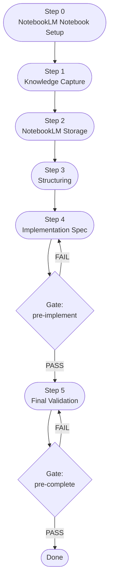
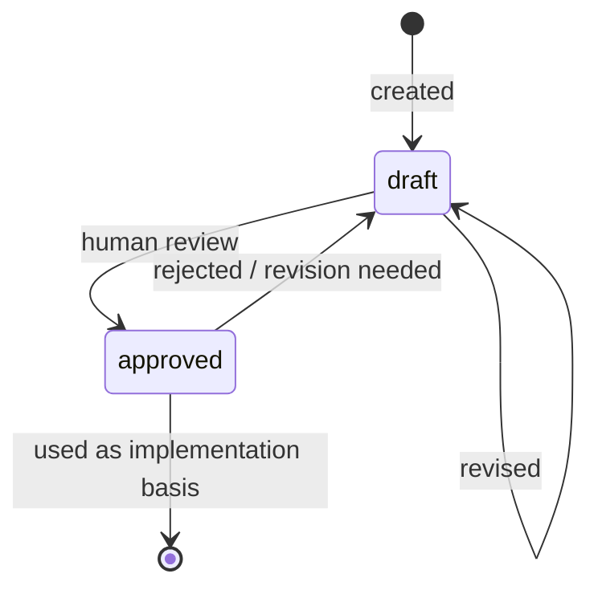
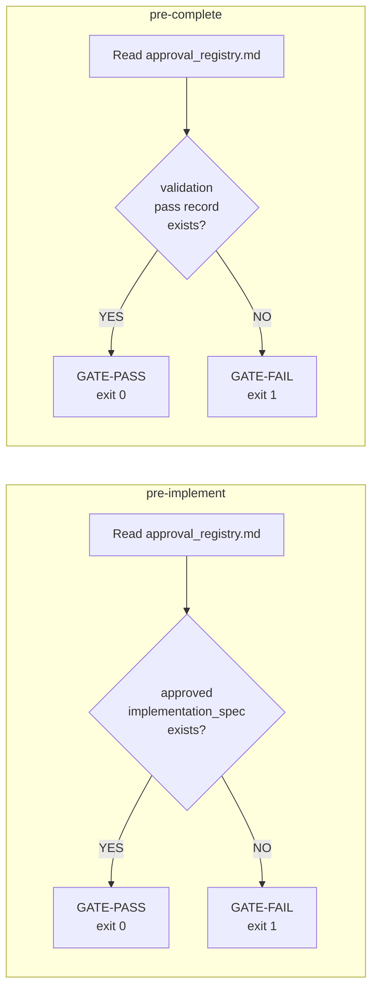
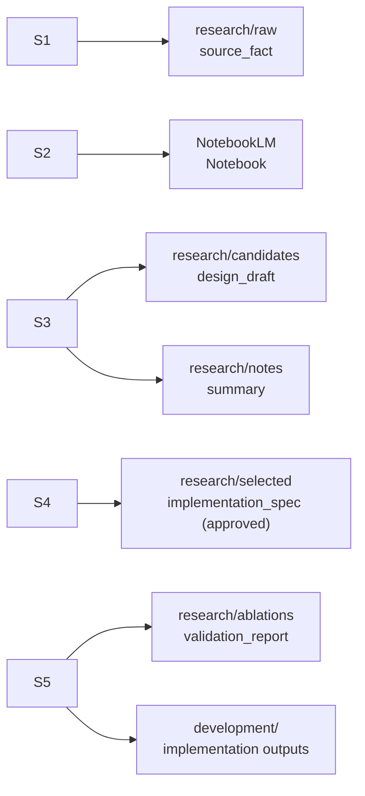

# Pipeline Diagram

## Full 6-Stage Pipeline Flow

```mermaid
flowchart TD
    S0([Step 0\nNotebookLM Notebook Setup])
    S1([Step 1\nKnowledge Capture])
    S2([Step 2\nNotebookLM Storage])
    S3([Step 3\nStructuring])
    S4([Step 4\nImplementation Spec])
    GI{Gate:\npre-implement}
    S5([Step 5\nFinal Validation])
    GC{Gate:\npre-complete}
    DONE([Done])

    S0 --> S1 --> S2 --> S3 --> S4 --> GI
    GI -- PASS --> S5
    GI -- FAIL --> S4
    S5 --> GC
    GC -- PASS --> DONE
    GC -- FAIL --> S5
```

## Artifact State Machine

```mermaid
stateDiagram-v2
    [*] --> draft : created
    draft --> approved : human review
    approved --> [*] : used as implementation basis
    draft --> draft : revised
    approved --> draft : rejected / revision needed
```

## Gate Decision Logic

```mermaid
flowchart LR
    subgraph pre-implement
      A[Read approval_registry.md] --> B{approved\nimplementation_spec\nexists?}
      B -- YES --> P1[GATE-PASS\nexit 0]
      B -- NO --> F1[GATE-FAIL\nexit 1]
    end
    subgraph pre-complete
      C[Read approval_registry.md] --> D{validation\npass record\nexists?}
      D -- YES --> P2[GATE-PASS\nexit 0]
      D -- NO --> F2[GATE-FAIL\nexit 1]
    end
```

## Folder Layout by Stage

```mermaid
graph LR
    S1 --> raw["research/raw\nsource_fact"]
    S2 --> nlm["NotebookLM\nNotebook"]
    S3 --> cand["research/candidates\ndesign_draft"]
    S3 --> notes["research/notes\nsummary"]
    S4 --> sel["research/selected\nimplementation_spec (approved)"]
    S5 --> abl["research/ablations\nvalidation_report"]
    S5 --> code["development/\nimplementation outputs"]
```
